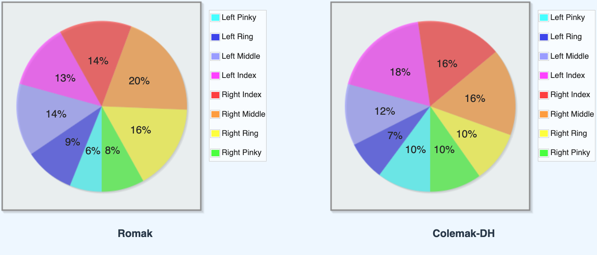

# rafaelromao's keyboard layout

## Romak

Romak is a new keyboard layout, inspired by [Colemak](https://colemak.org), [BEAKL](https://ieants.cc/beakl) and [Engram](https://engram.dev), improved to remove load from pinkies and indexes, for typing in Portuguese and English, using a one-shot layer to extend the base layer with accented and less frequent keys.

- Romak is designed for boards with only 30 keys, in the format 23332+2, with the alphas distributed only in the main 20 keys, avoiding lateral movement.

- The name Romak is a combination of my last name, **Rom**ão, and Dvor**ak**'s name.
- Romak assumes the right hand as dominant and puts all vowels plus R, L, H, J and V on that side.

- There is also a 3x5+2 version, which can be seen below, along with the numbers and symbols:

- The performance of both versions is quite similar.

## KLA Next
[KLA Next](https://klanext.keyboard-design.com/) was used to compare Romak with Colemak-DH and some other layouts, using the Universal Declaration of Human Rights as text corpus, combining [Portuguese and English](analysis/corpus.txt).
### General Performance

Romak has 2 alpha layers, with an oneshot key used to quickly alternate between them. This is not supported by KLA Next, so some adjustments were necessary:
- Use AltGr instead of the oneshot key, so the tool considers the AltGr held to access the secondary alpha layer.
- All layouts involved in the comparison have the same thumb configuration.
- Symbols and numbers were excluded from the analysis for all considered layouts.
- The files with this configuration can be found [here](../docs/analysis/).
- With this configuration, Romak scores slightly better than the others.

### Heatmaps

Heatmaps show that Romak puts more load on middle and ring fingers and less load on index and pinky fingers, when compared to Colemak-DH.

  
   

### Finger Usage
In Romak, fingers in the left hand will take less load than the equivalent fingers in the right hand.

### Colemak mod-DH analysis tool
The [Colemak mod-DH analysis tool](https://colemakmods.github.io/mod-dh/analyze.html) was also used to compare Romak against Colemak-DH.
- English text corpus only.
- Consider the 34 key version of Romak, with q, x, k and y in the base layer.

  
  

### Keysolve
The [Keysolve analyzer](https://clemenpine.github.io/keysolve-web/) was also used to compare Romak against Colemak-DH.
- English text corpus only.
- Consider the 34 key version of Romak, with q, x, k and y in the base layer.

  
  

## Extentions

- The [Accents and Macros](macros.md) layers extend the Romak base layer to give easy access to common Portuguese accented characters, along with the letters z and x.
- The [Lower and Raise](symbols.md) layers give access to function keys, symbols and numbers. The symbols are arranged to make them easy to use in software programming, with VIM, and math operations.

##
[Home](../readme.md) | 
Base |
[Modifiers](modifiers.md) |
[Accents and Macros](macros.md) |
[Symbols and Numbers](symbols.md) |
[Navigation and Media](navigation.md) |
[System](system.md)
