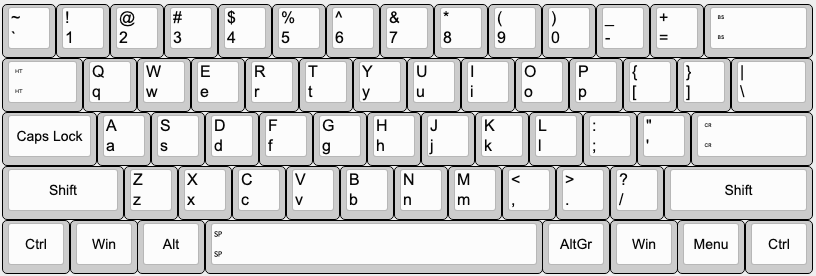
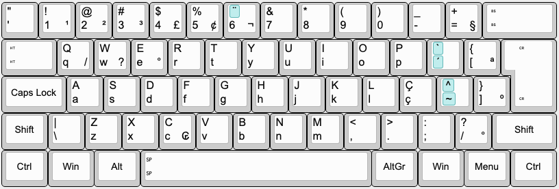

## MJ64 ABNT2
### A Melgeek MJ64 adapted to Brazilian ABNT2!

#### MJ64 ANSI ABNT2

#### Reference ANSI

#### Reference ABNT2

### About the layout

MJ64 comes in ANSI layout, but Brazilian ABNT2 extends the ISO layout.

The main differences between ANSI and ABNT2 are:
- In ANSI, Enter is 2.75u in R3 only, there is an 1.5u extra key above it and a missing 1u key at its left.
- In ANSI, left shift is 2u or 2.25u (2u for MJ64), while in ABNT2, it is 1.25u and there is an extra 1u key at its right.

For MJ64 in particular, there is an inverted T navigation cluster at the bottom right and an extra key at the right of the up arrow.

The following adaptations were made to make ABNT2 fit into MJ64:
- The ANSI key above Enter, Backslash, was kept as is. In ABNT2 it was expected to be between Left Shift and Z, but there is no key between them it ANSI. This is a big commitment, but with low impact, since this key is rarely used.
- Semicollon and Slash were moved to the left of the Up Arrow, replacing Slash and Shift, respectively. Slash is now a mod-tap key that will act as Shift while held, so that right shift is still possible and we gain an extra key in the board.
- Quote was moved to the left of 1 and act as Escape when tapped and Quote when held, so that we can have both Escape and Quote in familiar positions for ABNT2 users, and also gain another extra key.
- Open Square Bracket moves to the place of Close Square Bracket, which in turn will be dropped from the board. The Open Square Bracket key will act as Close Square Bracket when held, giving us another extra key.
- The three extra keys that we got will be used for exclusive ABNT2 key codes:
  - At the right of P, there is Acute, which is a dead Quote and sends a dead Grave when shifted.
  - At the right of L, there is Cedilla.
  - And at the right of Cedilla there is Tild, which is also a dead key and sends a dead Caret (circunflex) when shifted.
  - Note that there are no leggends for these keys in the pictured keycap set, so I used dot, asterix and dash for them, respectively.

With these changes, this ANSI board will work quite similar to an ABNT2 board.

### QMK

The qmk version recommended for this keyboard is 0.18.1.

#### Compile

`qmk compile -kb melgeek/mj64/rev3 -km clopes.le`

#### Flash

`qmk flash -kb melgeek/mj64/rev3 -km clopes.le`
